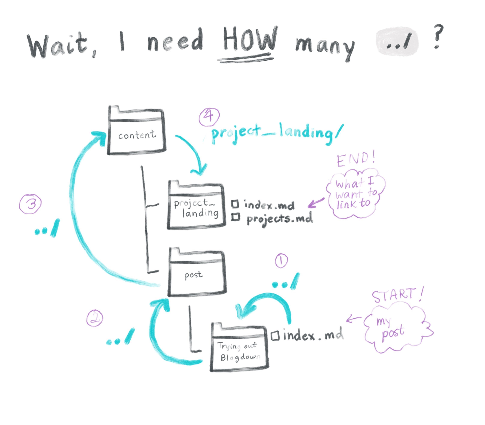

# Hello!
This is my very first blog post using an R Markdown file within blogdown. I'm going to demonstrate how we can include the following in a single post:

1) R code
2) A plot
3) An image (via markdown syntax)
4) An image (via `knitr::include_graphics`)
5) A relative link to another section in my site
6) A demo using a dataset that I have read in


# 1) Iris data set
Let's make a plot using the `iris` data set in `ggplot2`.
```{r}
library(ggplot2)

# Dataset
head(iris)

```


<br>
# 2) Plotting
```{r}

scatter <- ggplot(data=iris, aes(x= Sepal.Length, y = Sepal.Width))
scatter + geom_point(aes(color=Species, shape=Species)) +
  xlab("Sepal Length") + ylab("Sepal Width")

```

<br>
# 3) Embedding a bundled image

Using markdown syntax `` to generate the image below:

I'm still wondering how to get the caption to show up when I embed images in this way.

<center> {width=500px} </center>
<br>
# 4) Using knitr

We can also accomplish this with a code chunk, setting the following parameter `out.width="500px", fig.align='center'`
```{r, out.width="500px", fig.align='center'}

knitr::include_graphics("valentin-lacoste-1675701-unsplash.jpg")
```

<br>
# 5) Relative links 

I can also include some relative links to, for example, tell you to check out this [other section of my site](../../../project_landing/)!

The structure of relative links is a bit confusing. When specifying the location of the page you want to get to, the reference point is the directory that your post lives in (and NOT the project root directory). 

This is a bit weird, so the fastest way to figure it out is probably by trial-and-error, but I'm a visual learner, so I had to diagram this out:

<br>

# 6) Reading in a data set

Sometimes its nice to call in `iris` and other times, you just wanna go your own way. Here's what it looks like to read in a .csv file that I have stored in the same directory as this blog post. This file has information about behavior or rhesus macaque monkeys. 

```{r warning = FALSE, message = FALSE}
library(dplyr)
library('DT')
```
<br>
We'll assign it to `behavior`.
```{r}
behavior <- readr::read_csv("aggression_behavior.csv")
```
<br>
Let's just take a quick look at what the structure of this data set is:

```{r}
dplyr::glimpse(behavior)
```

<br>

And now, let's use the `DT` package to make this into a table that's easier to manage.

```{r}
datatable(behavior)
```

<br>

Hmm...blogdown leaves me with yet another mystery. The datatable renders just fine within the RStudio IDE, but not when the site renders. How can this be?
